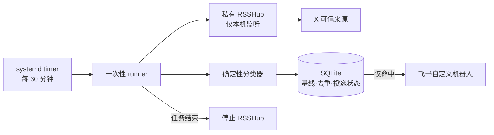

# Codex Quota Monitor

Codex Quota Monitor 是一个面向个人用户的轻量级信息监控产品：每 30 分钟检查固定的 X 可信来源，只在出现“Codex 额度已重置、正在重置、将要重置、可能恢复或已发放可保存重置次数”的可信信号时推送飞书消息。它不使用付费 X API，并且为低配、已承载其他服务的 VPS 设计。

> 当前状态：`0.2.0`，可用于单机自托管。本项目与 OpenAI、X 和飞书无隶属或背书关系。

## 为什么需要它

Codex 额度调整的消息可能先由 OpenAI 官方账号或相关工作人员在 X 上发布。手工刷新容易错过，普通关键词订阅又容易把疑问、愿望、转发和营销内容当成事实。本项目把“可信来源、保守判定、去重投递”组合成一个安静的小型产品。

## 核心价值

- 快：默认每 30 分钟自动检查，无需手动巡视。
- 准：固定信任白名单，按产品、额度、动作和时间/恢复证据分层判定。
- 安静：没有命中就不推送；首次基线静默，不补发历史帖子。
- 稳：SQLite 去重与发送前 claim，遇到不确定投递时优先避免重复骚扰。
- 轻：按需启动 RSSHub，任务结束即退出；systemd 限制为 384 MiB 内存和 30% CPU。

## 功能与边界

### 已实现

- 监控 `@OpenAI`、`@OpenAIDevs`、`@thsottiaux` 和 `@sama`。
- 识别已完成、进行中、未来计划、可能重置和 `banked reset` 五类额度事件；低置信度候选会明确提醒“可能是额度重置，请确认”，可保存重置次数使用独立文案，不会被描述成当前额度已经自动恢复。
- 引用元数据（包括 `quoted_text`）仅用于审计和展示上下文，永不作为分类匹配证据；转发也不作为证据。

当前免费 X 适配器仅使用 `UserTweets` 监控四个账号的顶层原创帖，并强制关闭回复与转发。转发、引用和回复不作为证据。X 当前对 `UserTweetsAndReplies` 返回 HTTP 404；只有上游恢复兼容且相关行为在测试保护下通过后，才能启用回复监控。
- 飞书业务通知、健康告警与恢复通知。
- 可审计的本地状态、dry-run、最近 7 天未匹配帖子有界幂等重处理，以及 `delivery-resolve` / `health-resolve` 人工核对。
- 保护已有 SSH、代理和订阅服务的上线前/后校验。

### 非目标

- 不是通用 X 爬虫或社交舆情系统。
- 不绕过 X 访问控制，不保证免费入口永久可用。
- 不使用 LLM 代替可审计的确定性规则。
- 不修改防火墙、SSH、现有节点或订阅服务。

## 快速理解架构



生产端口为本机 `1200`，dry-run 使用隔离的 `1201`。完整组件、时序和投递状态见 [架构设计](docs/architecture/ARCHITECTURE.md)。

## 可信来源与通知语义

可信来源是代码审查的固定白名单，不由运行时帖子动态扩展。业务通知包含来源、原文链接和规则判定，表示“可信账号发布了符合规则的消息”，不代表对实际账户额度做技术校验。四个来源连续三轮全部失败，或 Cookie 明确失效时，系统只告警一次；全部恢复后只通知一次。两类健康通知也使用发送前 claim；结果不确定时进入 `uncertain`，绝不自动重发，须用 `health-resolve` 人工核对。

## 文档导航

| 角色 | 文档 | 用途 |
| --- | --- | --- |
| 产品 | [PRD](docs/product/PRD.md) | 用户、需求、验收标准和路线图 |
| 开发 | [架构设计](docs/architecture/ARCHITECTURE.md) | 组件、时序、数据和信任边界 |
| 运维 | [部署指南](docs/operations/DEPLOYMENT.md) | 安装、验证和启用 |
| 运维 | [Runbook](docs/operations/RUNBOOK.md) | 日常查看、Cookie 轮换、故障和回滚 |
| 安全 | [安全说明](docs/security/SECURITY.md) | 秘密、最小权限和威胁模型 |
| 质量 | [测试指南](docs/testing/TESTING.md) | 测试层次与发布门禁 |
| 协作 | [贡献指南](CONTRIBUTING.md) | 本地开发和 PR 规范 |
| 发布 | [变更日志](CHANGELOG.md) | 版本变化 |

重要取舍记录在 [ADR 目录](docs/decisions/README.md)。

## 快速开始

本地验证不需要真实密钥或外网服务：

```bash
uv sync --locked --extra test --no-editable
uv run --no-sync pytest
```

VPS 上线前，请完整阅读 [部署指南](docs/operations/DEPLOYMENT.md)，先执行 `make preflight`，再安装和 dry-run，最后在 `make postflight` 与 `make resource-check` 均通过后执行 `make enable`。不要把 X Cookie、飞书 Webhook 或签名密钥写入 Git。

## 安全与项目状态

本项目仅将 RSSHub 绑定到 loopback，以非登录用户运行，并通过 systemd 设置文件系统、CPU 和内存边界。免费 X 入口依赖会话 Cookie 与上游路由，可能随时变化；部署者应保留人工查看原帖和轮换 Cookie 的能力。未设定开源许可证，在许可类型确定前请先提交 issue 讨论复用方式。
