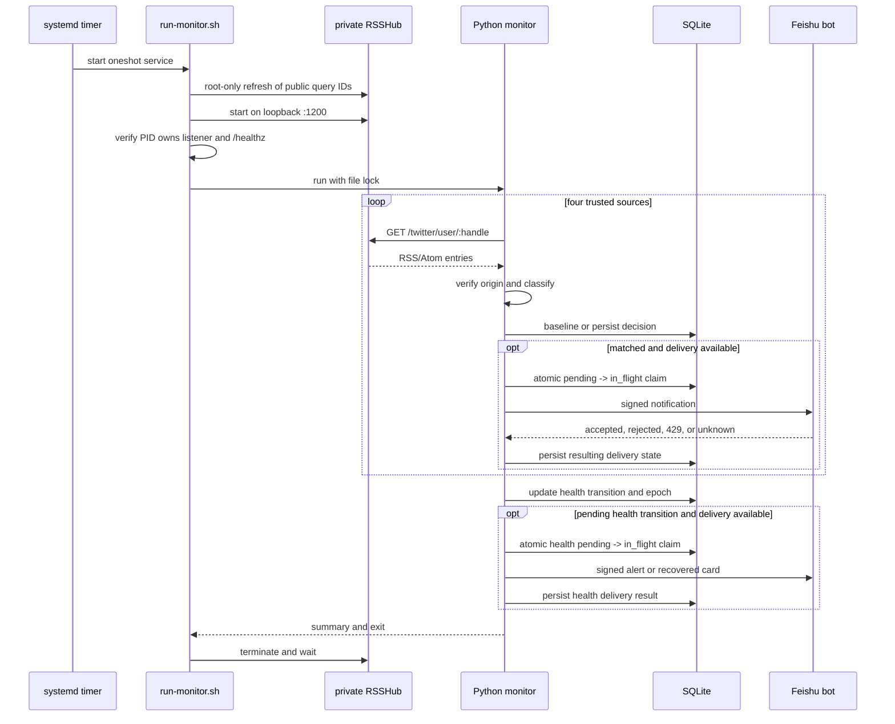
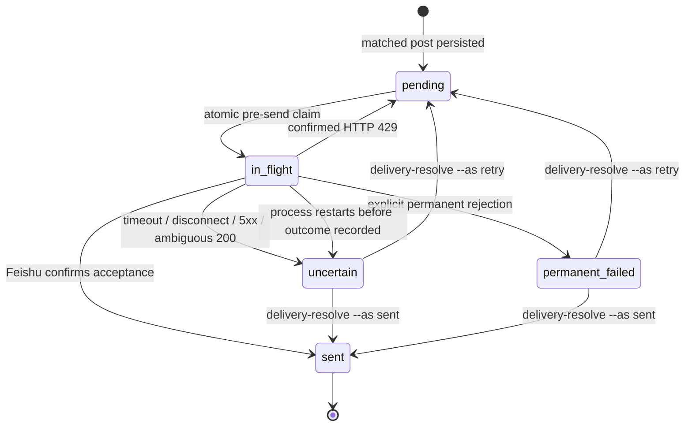

# 架构设计

## 设计原则

1. 信任必须是显式配置，不从社交关系或转发链动态推导。
2. 无消息是正常结果；低误报优先于高覆盖。
3. 有状态的投递策略优先避免重复，不把网络超时当成“一定失败”。
4. 短时、有边界的任务优先于常驻进程，既降低资源占用也减少故障面。
5. 监控工具不得修改宿主机的 SSH、防火墙、代理或订阅服务。

## 组件

| 组件 | 职责 | 生命周期/边界 |
| --- | --- | --- |
| systemd timer | 默认每小时触发 service | 常驻的只是 systemd 计时器 |
| `run-monitor.sh` | 启动 RSSHub、验证监听者、运行 Python、无条件清理 | 单次任务，最长 5 分钟 |
| 项目私有 RSSHub | 使用 X `auth_token` 和 `UserTweets` 提供四个用户的顶层原创帖 | 仅 loopback；生产 `1200`，dry-run `1201` |
| Query ID refresh | 从 X 官方前端包严格提取两个查询 ID | 单独 root 预处理；仅 RSSHub `dist-lib` 可写 |
| `RssHubClient` | 抓取、重试、JSON/XML 解析和原帖作者/链接校验 | Python 3.12 标准库 |
| 确定性分类器 | 白名单、产品、限制、重置和排除语义 | 无网络、无 LLM |
| `Store` | 基线、去重、投递状态和健康状态 | SQLite/WAL，生产持久化 |
| `FeishuClient` | 签名并发送业务/健康卡片 | 只访问配置的 Webhook |
| CLI | `run`、`dry-run`、`status`、`test-notification`、`delivery-resolve`、`health-resolve` | 管理员显式调用 |

## 单次运行时序

dry-run 走同一个抓取与分类路径，但被 transient unit 强制改用 `1201` 与 PrivateTmp 中的临时数据库，不写正式基线，不向飞书发送业务卡片。

## 数据模型

SQLite 包含三类表：

- `posts`：以 `post_id` 为主键，保存来源、原文、发布时间、链接、引用元数据、分类决策、内容哈希、投递状态、尝试次数和安全错误标签。引用元数据（包括 `quoted_text`）仅用于审计和展示上下文，永不作为分类匹配证据；转发也不作为证据。
- `sources`：以 handle 为主键，保存是否已基线化、最后成功时间和最后安全错误。
- `state`：键值状态，用于连续全失败轮数、健康告警激活标记，以及健康迁移的 epoch、投递状态、尝试次数和安全错误标签。

SQLite 不存储 X Cookie、飞书 Webhook 或飞书签名密钥。

## 投递状态机

`in_flight` 是发送前持久 claim，不是可自动重试队列。如果进程在 claim 后中断，下次初始化会将它迁移为 `uncertain`。这是 at-most-once 目标下的审慎取舍，详见 [ADR-002](../decisions/ADR-002-at-most-once-delivery.md)。

健康 `alert` / `recovered` 复用同一投递状态机，但独立保存递增 epoch。`uncertain` 或 `permanent_failed` 只能通过 `health-resolve alert|recovered --as sent|retry` 处理；人工标记 `sent` 与 `alert_active` 更新在同一 SQLite 事务中完成。

## 信任边界

- 可信身份：路由指定的 handle 与返回的 X status URL 作者必须一致；配置白名单为 `@OpenAI`、`@OpenAIDevs`、`@thsottiaux` 和 `@sama`。
- 不可信内容：帖子正文、HTML、标题、引用文本和返回的 URL 都必须被解析与校验，不能成为代码或日志格式。
- 引用边界：分类器只读白名单作者的原创正文；引用作者是否可信都不改变引用元数据的非证据属性。
- 路由边界：生产适配器强制 `includeReplies=0` 和 `includeRts=0`，仅调用 `UserTweets` 的顶层原创帖。转发、引用和回复不作为证据。`UserTweetsAndReplies` 当前返回 HTTP 404；不得在缺少测试保护时开启。
- 秘密边界：`.env` 是唯一生产秘密入口，文件属于 `root:codex-monitor` 且模式为 `0640`。
- 网络边界：RSSHub 只能绑定 loopback；runner 会校验监听地址和 PID 归属，防止把其他进程当成健康的 RSSHub。
- 写入边界：Query ID 更新由 root 预处理命令完成，只为锁定 RSSHub 包的 `dist-lib` 开放写入；正式 RSSHub 和 Python 仍以 `codex-monitor` 运行。

## 故障语义

| 故障 | 处理 | 对用户的影响 |
| --- | --- | --- |
| 单来源抓取失败 | 记录安全错误，继续其他来源 | 不立即告警 |
| 四来源全失败 | 连续三轮后产生一次 alert | 不每轮刷屏 |
| 明确认证失败 | 直接达到告警阈值 | 提示轮换 Cookie |
| 部分来源恢复 | 清空全失败计数，保持 alert | 无恢复通知 |
| 全来源恢复 | 生成并确认 recovered | 只通知一次 |
| 飞书 429 | 当轮有界重试；仍失败则回 `pending` | 下轮可继续 |
| 飞书结果不确定 | 业务与健康投递均记为 `uncertain` 并不自动重发 | 需人工核对 |

## 资源隔离

- service 的 `MemoryMax=384M`（384 MiB）、`CPUQuota=30%`、`TimeoutStartSec=5min`、`Nice=10` 和 idle I/O 调度限制了对宿主机的影响。
- RSSHub 额外使用 `NODE_OPTIONS=--max-old-space-size=256`，且只在任务期间存活。
- `NoNewPrivileges`、`ProtectSystem=strict`、`ProtectHome=true`、`PrivateTmp=true` 限制进程视图与写入范围；正式进程只写项目 `data` 和专用日志目录，root 预处理另外只写 RSSHub `dist-lib`。
- preflight/postflight 对受保护服务的 active 状态、unit 哈希和监听者归属做对比，而不对它们执行修复。

## ADR 导航

- [ADR-001：免费 X 入口](../decisions/ADR-001-free-x-ingestion.md)
- [ADR-002：at-most-once 投递](../decisions/ADR-002-at-most-once-delivery.md)
